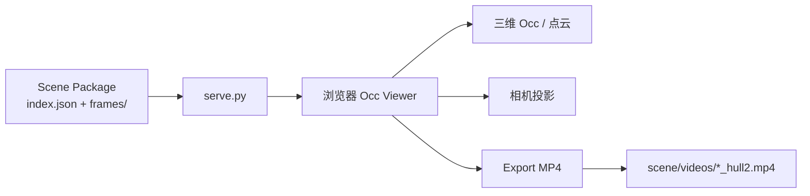
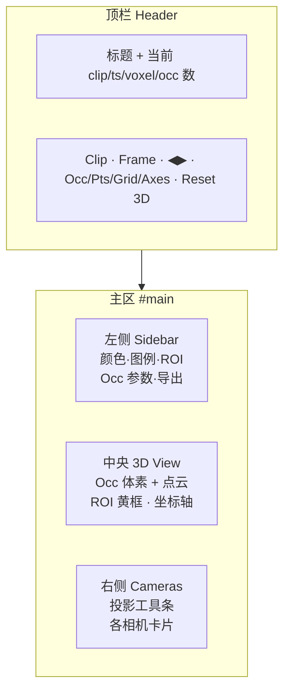
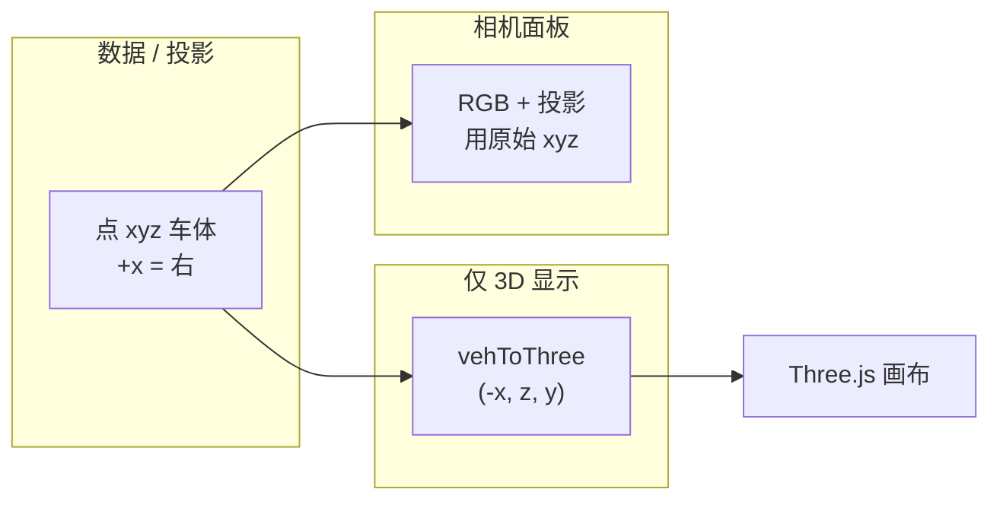
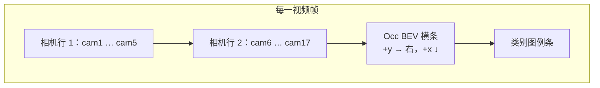
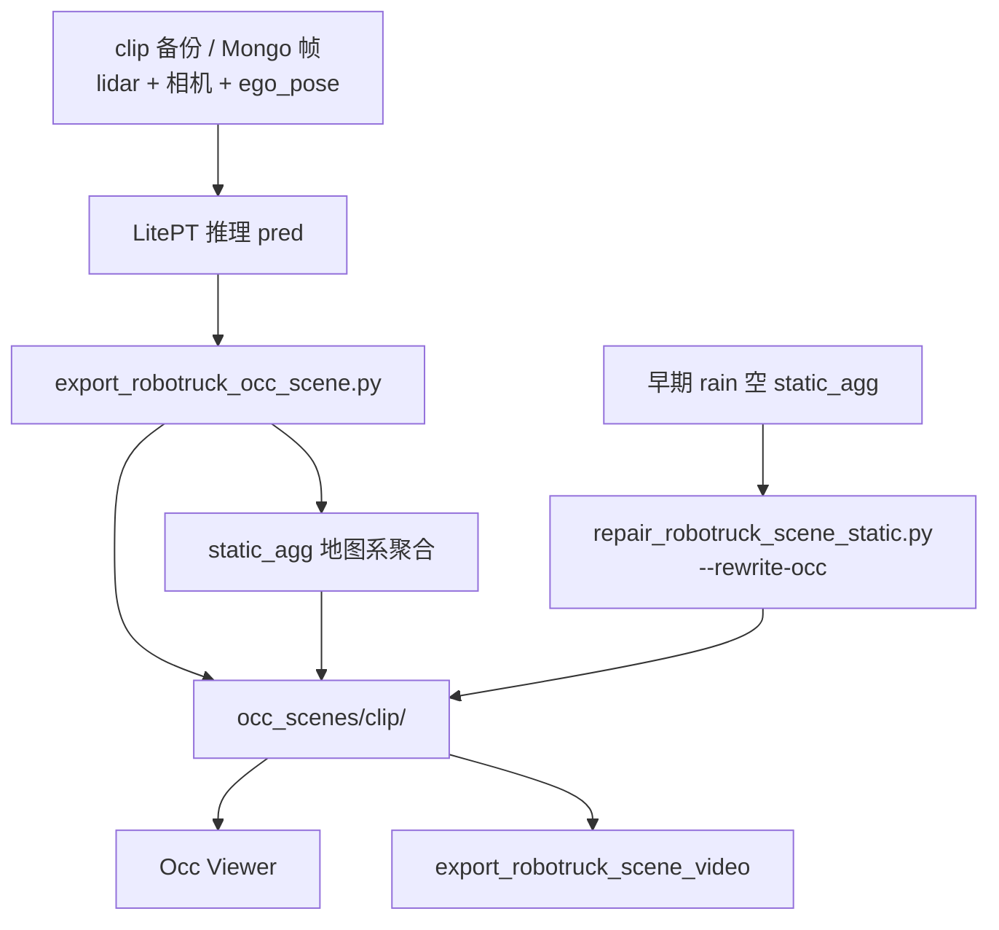

# Robotruck Occ Viewer — 操作手册

> 版本对应前端：`web/app.js`（`app.js?v=occ-fix-29` 及之后）  
> 数据约定见 [SCHEMA.md](./SCHEMA.md)；Robotruck Mongo 见 [formats/robotruck_mongo.md](./formats/robotruck_mongo.md)  
> 适用对象：需要查看 Robotruck occupancy / 点云 / 多相机投影、并导出对照视频的同事

---

## 目录

1. [它是什么](#1-它是什么)
2. [五分钟上手](#2-五分钟上手)
3. [页面总览（布局图）](#3-页面总览布局图)
4. [坐标系与左右约定（必读）](#4-坐标系与左右约定必读)
5. [顶栏：Clip / Frame / 图层开关](#5-顶栏-clip--frame--图层开关)
6. [中央：三维视图操作](#6-中央三维视图操作)
7. [左侧栏：颜色 / 图例 / ROI / Occ / 导出](#7-左侧栏颜色--图例--roi--occ--导出)
8. [右侧：多相机投影](#8-右侧多相机投影)
9. [灯箱放大（Lightbox）](#9-灯箱放大lightbox)
10. [视频导出详解](#10-视频导出详解)
11. [数据从哪来、怎么更新](#11-数据从哪来怎么更新)
12. [快捷键与交互一览](#12-快捷键与交互一览)
13. [推荐工作流](#13-推荐工作流)
14. [常见问题排查](#14-常见问题排查)
15. [附录：HTTP API](#15-附录http-api)

---

## 1. 它是什么

**Robotruck Occ Viewer** 是一个纯前端可视化工具，用来检查已经导出好的 **Occ Scene Package**（不重新跑推理）：

| 能力 | 说明 |
|------|------|
| 三维 Occupancy | 按格子对齐的体素立方体（可调透明度、间隙、放大系数） |
| 三维点云 | 可选；常为 clip 级 `static_agg`（地图系）+ 本帧动态，经 `ego_pose` 变到车体 |
| 多相机 RGB | 每帧各相机 JPEG |
| 投影叠加 | Occ = 体素 8 角点 → 凸包；点云 = 像素级投影 |
| ROI | 车体坐标系裁剪显示范围 |
| 导出 MP4 | 多相机拼图 + BEV occ + 类别图例（服务端脚本，无需再 infer） |



---

## 2. 五分钟上手

### 2.1 准备数据

场景包目录示例（每个子目录一个 clip）：

```text
exp/robotruck/occ_scenes/
  stop_1784423032302844849_vehicle-V002-20260719_090818/
    index.json
    static_agg/          # 可选，clip 级静态（地图系）
    frames/<ts>/...
    videos/              # 导出后生成
  rain_.../
    ...
```

若还没有场景包，用各自格式的导出器生成符合 [SCHEMA.md](./SCHEMA.md) 的目录。

### 2.2 启动服务

**推荐（多 clip）：**

```bash
python serve.py \
  --scenes-root /path/to/occ_scenes \
  --host 0.0.0.0 --port 8765
```

**单 clip（兼容）：**

```bash
python serve.py \
  --scene /path/to/occ_scenes/<clip> \
  --host 0.0.0.0 --port 8765
```

### 2.3 打开页面

本机：

```text
http://127.0.0.1:8765/
```

> **注意：** Pod / K8s 内网 IP（如 `10.244.x.x`）外网同事通常打不开，需要平台端口代理或 `kubectl port-forward`。详见下文「分享给别人看」。

打开后应看到：顶栏可选 Clip/Frame，中间有三维网格与坐标轴，右侧有相机缩略图。

---

## 3. 页面总览（布局图）

宽屏（≥1200px）为三栏；窄屏时相机区折到下方。



| 区域 | DOM / 作用 |
|------|------------|
| 顶栏 | 选 clip/帧、开关图层、重置视角、状态文字 |
| 左侧 | 颜色模式、类别图例、ROI、体素重建、视频导出 |
| 中央 | Three.js 场景（OrbitControls：拖旋转 / 滚轮缩放） |
| 右侧 | 投影模式、透明度、点像素大小；点击相机进灯箱 |
| 灯箱 | 全屏放大当前相机（滚轮缩放、拖拽平移） |

左下角半透明图例始终提示车体轴含义：

- **红 +X** = 车体右侧（bin 中 `+x`）
- **绿 +Y** = 车体前方（`+y`）
- **蓝 +Z** = 向上（`+z`）

---

## 4. 坐标系与左右约定（必读）

### 4.1 车体坐标系（数据里存的）

```text
        +z (up)
         ^
         |
         o----> +x (right / lateral)
        /
       v
      +y (forward)
```

- **+x**：横向，数值增大 = **车辆右侧**
- **+y**：前方
- **+z**：上方

相机外参：`extrinsic.transformation` = \(T_{v\leftarrow c}\)（相机位姿在车体下）；viewer / 导出用 \(T_{c\leftarrow v}=\mathrm{inv}(T_{v\leftarrow c})\) 做投影。

### 4.2 三维显示如何对齐「左右」

浏览器里默认相机在车**后方**、朝前看。为了与前视相机图像左右一致，显示映射为：

```text
Three.js 坐标 = (−x_veh,  z_veh,  y_veh)
```

因此：**重置视角后，右侧车道上的卡车应同时出现在 3D 画面右侧与 camera1 图像右侧。**

相机投影**不**走这套取反，始终用原始车体 xyz，所以「图上叠投影」与「3D 左右」应一致。



### 4.3 ROI 默认范围

| 轴 | 默认 (m) | 含义 |
|----|----------|------|
| x | \([-24,\ 24]\) | 左右各约 24 m |
| y | \([-25,\ 150]\) | 后方一点到前方 150 m |
| z | \([-5,\ 3]\) | 高度 |

---

## 5. 顶栏：Clip / Frame / 图层开关

### 5.1 Clip

下拉选择 `scenes-root` 下各带 `index.json` 的目录名（如 `stop_...`、`rain_...`）。切换会重新加载该 clip 的 `index.json`、可选 `static_agg`，并跳到第一帧。

### 5.2 Frame

下拉为时间戳列表。也可用：

- **◀ Prev / Next ▶**
- 键盘 **← / →**（焦点不在输入框时）

右侧灰色字显示 `当前序号 / 总帧数`。

### 5.3 图层开关

| 勾选 | 作用 |
|------|------|
| **Occupancy** | 显示/隐藏体素网格 |
| **Points** | 显示/隐藏点云；若无开 Occ，体素会自动半透明以免挡住点 |
| **Ground grid** | 地面参考网格 |
| **Axes** | 红绿蓝坐标轴箭头与标签 |

**Reset 3D view**：回到默认「车后方抬高、朝前看」的舒适视角。

顶栏最右 **status** 会显示加载进度、投影刷新提示、导出状态摘要等。

---

## 6. 中央：三维视图操作

| 操作 | 方式 |
|------|------|
| 旋转 | 鼠标左键拖拽 |
| 平移 | 右键拖拽（OrbitControls）或中键（视 three 版本） |
| 缩放 | 滚轮 |
| 重置 | 顶栏 **Reset 3D view** |

黄色线框（若开启）= 当前 ROI 盒子。

**建议：**

1. 先 **Reset 3D view**，再对比右侧 camera1，确认左右一致。  
2. 看远距离结构时适当关掉 Points，只留 Occupancy。  
3. 点云与 Occ 同时开时，把 Occ Opacity 滑条再调高一点若觉得太透。

---

## 7. 左侧栏：颜色 / 图例 / ROI / Occ / 导出

### 7.1 Color mode

| 模式 | 作用对象 | 说明 |
|------|----------|------|
| **Fine 22-class** | Occ + 点云 + 投影 | Waymo 细类语义色 |
| **Coarse 4-class** | 同上 | dynamic / static / freespace / noise；可单独勾选显示 |
| **Lidar id (points)** | **仅点云与点投影** | lidar_1 / 2 / 14 着色；Occ 仍按语义色 |

粗类与雷达开关只在对应 Mode 下显示。

### 7.2 Class legend

随 Color mode 切换图例色块。细类名来自 `index.json` → `taxonomy.fine`（或帧 meta）。

### 7.3 ROI (vehicle xyz)

1. 填 x/y/z 的 min、max。  
2. 点 **Apply ROI**。  
3. **Show ROI box**：画黄框。  
4. **Clip display to ROI**：勾选后，3D 点/体素与用于投影的点都会按 ROI 过滤。

**Reset default** 恢复 `[-24,24]×[-25,150]×[-5,3]`。

### 7.4 Occupancy grid

体素逻辑（与导出一致）：

```text
ix = floor((x - x0) / voxel)
iy = floor((y - y0) / voxel)
iz = floor((z - z0) / voxel)
```

显示立方体贴在格子上，不是「以每个点为中心随便画一块」。

| 控件 | 含义 |
|------|------|
| **Voxel (m)** | 客户端重建时的格子边长（默认常与导出 0.2 一致） |
| **Rebuild occ** | 用**当前已加载点云**在浏览器里重新 voxelize（不改磁盘文件） |
| **Reset exported** | 恢复该帧导出时的 occ bin |
| **Opacity** | 体素透明度 |
| **Gap** | 立方体之间缝隙（0 = 紧贴） |
| **Size×** | 略放大立方体，减轻深度缓冲缝 |
| **Point size** | 三维点大小 |

若提示没有 points：导出时需带 `--export-points`，或场景里有可用的 `static_agg`。

### 7.5 Export video

见 [第 10 节](#10-视频导出详解)。

---

## 8. 右侧：多相机投影

### 8.1 工具条

| 控件 | 选项 / 范围 | 说明 |
|------|-------------|------|
| **Project** | RGB only / Occupancy / Points / Occ+Points | 叠在 RGB 上的内容 |
| **Alpha** | 0.1–0.85 | 叠加透明度 |
| **Pt px** | 1–3 | 点投影最小像素边长 |
| **Refresh projection** | — | 强制重画所有相机（及打开中的灯箱） |

提示文案：**RGB underlay · occ = voxel cubes (8 corners) · click to enlarge**

### 8.2 Occupancy 投影算法（与导出一致）

对每个占据体素：

1. 取格子 8 个角点 → 畸变投影到像素；  
2. 凸包填充；  
3. 剔除：角点在相机后、中心出画、轮廓过大、强畸变炸开等。

**不是**旧版「体素中心画轴对齐方块」。

### 8.3 相机卡片

- 标题：相机名 + 分辨率；提示 click to zoom。  
- 点击画面 → 打开灯箱。  
- 点击标题条可选中卡片（高亮边框）。

常见相机名：`camera1`…`camera9`、`camera17`（以前视 / 侧视 / 后视组合为主；侧视广角更易出现边缘畸变，属标定模型表现）。

---

## 9. 灯箱放大（Lightbox）

点击任一相机画面进入全屏：

| 控件 / 操作 | 作用 |
|-------------|------|
| Zoom + / − | 放大缩小 |
| Reset view | 适配窗口 |
| Close / **Esc** | 关闭 |
| 滚轮 | 缩放 |
| 拖拽 | 平移 |

灯箱内使用与缩略图相同的投影模式与 Pt px。改工具条后若灯箱已开，可再点 **Refresh projection**。

---

## 10. 视频导出详解

### 10.1 页面上怎么导

1. 在左侧选 **Overlay**：Occupancy / Points / Both / RGB only。  
2. 设 **FPS**（默认 5）、**Max frames**（`0` = 全部）。  
3. 点 **Export MP4**。  
4. **vidStatus** 会轮询进度（`frame a/b`）。  
5. 完成后 **Refresh list**，点链接下载。

输出目录：

```text
<scene>/videos/<clip>_scene_<mode>_v<voxel>_hull2.mp4
```

文件名含 **`hull2`** 表示使用「体素凸包」投影（与当前网页一致）。旧文件 `*_scene_occ_v0.2.mp4`（无中心方块）不要拿来对比新逻辑。

### 10.2 画面构成（示意）



- **不重新推理**，只读场景包里的 occ / points / JPEG。  
- 服务端调用：`scene_video.py`。

### 10.3 命令行等价导出

```bash
export PYTHONPATH=./
.venv_smoke/bin/python scene_video.py \
  --scene exp/robotruck/occ_scenes/stop_... \
  --mode occ --fps 5 --tile-w 960 --tile-h 540 \
  --max-frames 0
```

### 10.4 导出日志

同目录下可有：

- `job_export.log` — 命令与进度  
- `job_status.json` — 任务状态快照  
- `*_hull2_meta.json` — 帧数、耗时等

---

## 11. 数据从哪来、怎么更新



| 步骤 | 脚本 / 路径 |
|------|-------------|
| 导出场景 | `tools/occ/export_scene.py` |
| 修空静态聚合 | `tools/repair_robotruck_scene_static.py --rewrite-occ` |
| 看网页 | `serve.py` |
| 导出视频 | 网页按钮或 `export_robotruck_scene_video.py` |
| 包格式 | `SCHEMA.md` |

**点云组成（有 static_agg 时）：**

- 静态：clip 级地图系点 → 每帧用 `ego_pose` 变到车体；  
- 动态：该帧标签中的动态类（车、人等），不跨帧硬拼（无 tracking 时）。

---

## 12. 快捷键与交互一览

| 快捷键 / 手势 | 场景 | 作用 |
|---------------|------|------|
| ← / → | 主界面（非输入框） | 上一帧 / 下一帧 |
| Esc | 灯箱打开时 | 关闭灯箱 |
| 滚轮 | 3D / 灯箱 | 缩放 |
| 左键拖 | 3D | 旋转 |
| 拖 | 灯箱 | 平移 |

---

## 13. 推荐工作流

### A. 快速质检一帧对齐

1. 开页面 → 选 clip → 跳到有车的帧。  
2. **Reset 3D view**。  
3. Project = **Occupancy**，看 camera1：车、护栏是否贴合。  
4. 对照 3D：右侧目标是否在屏幕右侧。  
5. 若颜色怪：确认 Color mode = Fine，看左侧图例。

### B. 查「是不是只聚合了点、没聚合 occ」

1. 切到 rain 等长距离 clip，看远方静态结构是否「一帧一变」。  
2. 打开 Points：若点已稠密、Occ 仍稀疏，对场景跑 `repair_robotruck_scene_static.py --rewrite-occ`。  
3. 刷新网页再看。

### C. 出片给评审

1. Overlay = Occupancy，Max frames 先设 20 试导出。  
2. 确认列表里是 `*_hull2.mp4`。  
3. 全量再导（Max frames = 0）。  
4. 把 mp4 拷到共享盘（网页链接若仅内网，用文件更稳）。

### D. 分享网页给别人

| 方式 | 说明 |
|------|------|
| 本机 | `http://127.0.0.1:8765/` |
| 同机房 / 有代理 | 用平台提供的 **notebook 端口代理 URL**，不要发 `10.244.*` Pod IP |
| 集群权限 | `kubectl port-forward pod/<name> 8765:8765` → 对方开本机 8765 |
| 无网络穿透 | 直接发 `videos/*_hull2.mp4` |

服务必须 `--host 0.0.0.0`，仅 `127.0.0.1` 时别人永远连不上。

---

## 14. 常见问题排查

| 现象 | 可能原因 | 处理 |
|------|----------|------|
| 页面空白 / 一直 Loading | 服务未起或 scene 路径错 | 看终端 `clips (...):`；确认 `index.json` 存在 |
| 三维左右与相机相反 | 缓存了旧 `app.js` | 硬刷新；确认 URL 带新 `?v=occ-fix-…` |
| 有 Occ 无点云 | 未导出 points / 无 static_agg | `--export-points`；或检查 `static_agg` |
| 点已聚合、Occ 仍单帧 | 导出时 agg 为空 | `repair_... --rewrite-occ` |
| 投影像「圆盘」或翅膀 | 旧逻辑 / 过强畸变未裁 | 用 hull2 导出；网页 Project=Occ 并 Refresh |
| 导出视频仍像大方块 | 打开了旧 mp4 | 选文件名含 **hull2** 的 |
| 侧视相机扭曲 | 广角 + radtan | 属模型；中心在画内的体素会保留 |
| 改 Voxel 无变化 | 只改数字未点 Rebuild | 点 **Rebuild occ**；或 Reset exported |
| 别人打不开链接 | Pod IP / 未代理 | 见 13.D |

---

## 15. 附录：HTTP API

`serve.py` 主要接口：

| 方法 | 路径 | 说明 |
|------|------|------|
| GET | `/` | 前端页面 |
| GET | `/api/clips` | clip 列表与 default |
| GET | `/scenes/<clip_id>/...` | 该 clip 场景静态资源 |
| GET | `/scene/...` | 默认 clip 别名 |
| POST | `/api/video/export` | body: `{clip_id?, mode, fps, max_frames, ...}` |
| GET | `/api/video/status` | 当前导出任务 |
| GET | `/api/video/list?clip_id=` | 已有 mp4 列表 |
| GET | `/videos/<clip>/<file>` | 下载视频 |

---

## 附录：Waymo 细类名称（Fine 22）

与训练/可视化调色板一致（索引 0–21）：

0 Car · 1 Truck · 2 Bus · 3 Other Vehicle · 4 Motorcyclist · 5 Bicyclist · 6 Pedestrian · 7 Sign · 8 Traffic Light · 9 Pole · 10 Construction Cone · 11 Bicycle · 12 Motorcycle · 13 Building · 14 Vegetation · 15 Tree Trunk · 16 Curb · 17 Road · 18 Lane Marker · 19 Other Ground · 20 Walkable · 21 Sidewalk

粗类映射：动态类 → dynamic；建筑/杆/植被等 → static；路面相关 → freespace；其余 → noise。

---

## 文档维护

| 文件 | 内容 |
|------|------|
| 本手册 `USER_MANUAL.md` | 操作与概念 |
| `docs/SCHEMA.md` | 规范 scene 包 |
| `serve.py` | 启动与 API |
| `web/app.js` / `web/index.html` | 前端 |
| `config/formats/*.yaml` | 格式 profile |

若 UI 大改，请同步更新本手册中的布局图、控件表与 `app.js?v=` 版本说明。
